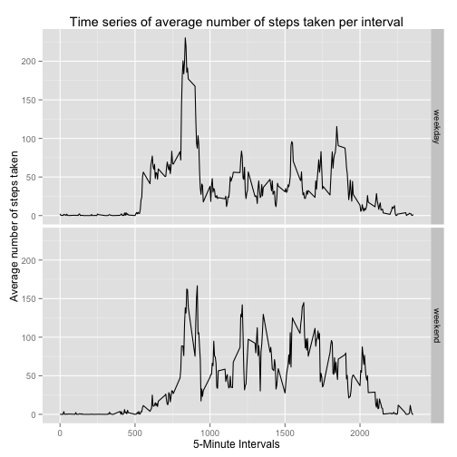

## Loading and preprocessing the data
Unzip the dataset first before running the code below

```r
library(knitr)
data <- read.csv("activity.csv")
```

## What is mean total number of steps taken per day?
Plotting a histogram of the total number of steps taken each day

```r
prepdata <- aggregate(data$steps, list(date = data$date),sum)
prepdata <- prepdata[complete.cases(prepdata),]
hist(prepdata$x,xlab="Total number of steps per day",main="Histogram of total number of steps per day")
```

 


Calculating the mean and median of the total number of steps taken per day

```r
mean(prepdata$x)
```

```
## [1] 10766.19
```

```r
median(prepdata$x)
```

```
## [1] 10765
```

## What is the average daily activity pattern?
Plotting a time series of the 5-minute interval and the average number of steps taken 

```r
intervaldata <- aggregate(data$steps,list(interval=data$interval),mean,na.rm=TRUE)
plot(intervaldata$x~intervaldata$interval, main = "Time series of average number of steps taken per interval", xlab="5-Minute Intervals",ylab="Average number of steps taken", type="l")
```

 

Identifying the 5-minute interval that contains the maximum number of steps

```r
intervaldata[which.max(intervaldata$x),1]
```

```
## [1] 835
```
## Imputing missing values

Calculating the total number of rows with NAs

```r
sum(is.na(data))
```

```
## [1] 2304
```

For any missing value in the dataset, it is filled in with the mean of that 5-minute interval

```r
na_indices <- which(is.na(data)==TRUE)
matched_indices <- match(data[na_indices,3],intervaldata$interval)

##Creating a new dataset with no NA values
datacomplete <- data
datacomplete[na_indices,1] <- intervaldata[matched_indices,2]
```
Creating histogram with new complete data

```r
prepdata2 <- aggregate(datacomplete$steps, list(date = datacomplete$date),sum)
hist(prepdata2$x,xlab="Total number of steps per day",main="Histogram of total number of steps per day")
```

 

Calculating the new mean and median of the total number of steps taken per day

```r
mean(prepdata2$x)
```

```
## [1] 10766.19
```

```r
median(prepdata2$x)
```

```
## [1] 10766.19
```
The mean did not change since averages of 5-minute intervals were used to fill in missing values but the median increased slightly for the new dataset.

## Are there differences in activity patterns between weekdays and weekends?
Creating a new factor variable "Day" with 2 levels - "weekday" and "weekend"

```r
datacomplete$date<-as.Date(datacomplete$date)
datacomplete$day<-"weekday"
datacomplete[weekdays(datacomplete$date)=="Saturday" | weekdays(datacomplete$date)=="Sunday",4]<-"weekend"
datacomplete$day <- as.factor(datacomplete$day)
```

Plotting a time series with 2 panels of the 5-minute interval and the average number of steps taken

```r
library(ggplot2)
##Re-averaging steps per interval based on data with missing values filled in
intervaldata2 <- aggregate(datacomplete$steps,list(interval=datacomplete$interval,day=datacomplete$day),mean)
##Plotting time series panels
g <- ggplot(intervaldata2,aes(interval,x))
g + geom_line() + 
    facet_grid(day~.) + 
    labs(title="Time series of average number of steps taken per interval") + 
    labs(y="Average number of steps taken", x = "5-Minute Intervals" )  
```

 

